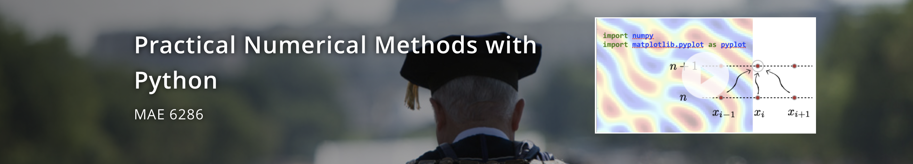

_"Practical Numerical Methods with Python"_ (a.k.a., [#numericalmooc](https://x.com/hashtag/numericalmooc?src=hash)) was an open online course, launched in August 2014 and offered in a self-hosted instance of the Open edX platform. In the first three years, it gathered **8,280** enrolled learners and we had several hundred of posts on the Discussion Forum. We also awarded hundreds of open digital badges to our online followers who completed the course-module assessments.

In 2017, we reinstalled the Open edX software and reset the course, which remained open for years thereafter. The platform was finally taken offline in May 2025. At that time, it showed **2,962** learners enrolled, so in total NumericalMOOC reached more than 11 thousand learners from around the world! 

Here, we reproduce the contents of the About page of the online course.

***

# Course Description

This is a first course in numerical methods for advanced students in engineering and applied science. It was developed in 2014, both as a massive open online course (MOOC) and a regular course at the George Washington University. Similar courses have been taught at partner institutions: Southampton University (UK), Pontifical Catholic University of Chile, and Université Libre de Bruxelles. The original MOOC instance stayed online until August 2017, reaching 8,280 registered users. 

This is a refreshed instance of the course, as the GW SEAS Open edX has been re-installed with the latest version of the software in August 2017. Users of the old site can access with their same login credentials, but course enrollments were not kept—please enroll again if you are still interested in this course! 

# What You'll Learn

* Connect the physics represented by a mathematical model to the characteristics of numerical methods to be able to select a good solution method
* Implement a numerical solution method in a well-designed, correct computer program
* Interpret the numerical solutions that were obtained in regards to their accuracy and suitability for applications

# Instructor

**Lorena A. Barba** Professor of Mechanical and Aerospace Engineering, The George Washington University

# Course Outline

* Getting Started
  - Initial Survey
  - How is this course going to work?
  - Course communication channels
  - Why Python?
  - Are you new to Python? The basics
  - Get Python
  - Ways to get help
  - Jupyter notebooks
  - What's git and why do I need it?
  - Using git and GitHub
  - Downloading (cloning) the notebooks
  - Self-Assessment checklist

* Module 1: The Phugoid Mode
  - Introduction. Phugoid theory
  - Module 1 graded assessment
  - Dig deeper: Euler's method and beyond 
     - https://youtu.be/6i6qhqDCViA

* Module 2: Space and Tim
  - Introduction to finite-difference solution of PDEs
  - Module 2 graded assessment
  - Dig deeper: Analysis of numerical schemes
    - https://youtu.be/1_T__XZtcfo

* Module 3: Riding the Wave
  - Riding the wave: Convection problems
  - Practice with Burgers' equatio
  - Module 3 graded assessment

* Module 4: Spreading Out
  - Spreading out: diffusion problems
  - Module 4 graded assessment

* Module 5: Relax and Hold Steady
  - Relax and hold steady: elliptic problems
  - Module 5 graded assessment

# Why take this course?

Even if this is the only numerical methods course you ever take, dedicating yourself to mastering all modules will give you a foundation from which you can start building a career in scientific computing.

# Who is the course for?

Numerical methods for differential equations are relevant across all of science and engineering. This course is for anyone with mathematical, scientific or engineering backgrounds who wishes to develop a grounding in scientific computing. Using a range of hands-on lessons, participants in the course will develop the basic skills to tackle modern computational modelling problems.

In developing this course, the instructors are inspired by the philosophy of open-source software. One of the tenets of the course is that we can use the web to interact, connect our learning, teach each other by sharing our learning objects. Therefore, this course is especially for those who are eager to participate in distributed knowledge creation on the web. Join us in this adventure!

# Prerequisites

The connected courses and MOOC are aimed at first-year graduate students or advanced seniors, and assume a background in vector calculus, linear algebra, and differential equations. We won't assume more than a beginner's programming experience and will guide students to develop a foundation in numerical methods, and hands-on experience coding up solutions to differential equations.

# Course Topics

The course consists of stacked learning modules that are somewhat self-contained. Each one is motivated by a problem that can be modeled by a differential equation (or system of DEs) and builds new concepts in numerical computing, new coding skills and ideas about analysis of numerical solutions.

The topics cover methods for time integration of simple dynamical systems (systems of ordinary differential equations); finite-difference solutions of various types of partial differential equations (hyperbolic, parabolic or elliptic); assessing the accuracy and convergence of numerical solutions; and using the scientific Python libraries to write these numerical solutions.

# Course Learning Modules

**(1) The phugoid model of glider flight.**

Described by a set of two nonlinear ordinary differential equations, the phugoid model motivates numerical time integration methods, and we will build it starting from an even simpler model (e.g., simple harmonic motion), building up to the full nonlinear model in 4 or 5 lessons on initial-value problems. Roughly, this module includes: a) Forward/backward differencing and Euler's method for simple harmonic motion; b) extension to the phugoid model; c) the midpoint method, convergence testing, local vs. global error; d) Runge-Kutta methods.

**(2) Space and Time—Introduction to finite-difference solutions of PDEs**

Starting with the simplest model represented by a partial differential equation (PDE)—the linear convection equation in one dimension—, this module builds the foundation of using finite differencing in PDEs. (The module is based on the [“CFD Python”](http://lorenabarba.com/blog/cfd-python-12-steps-to-navier-stokes/) collection, steps 1 through 4.) It also motivates CFL condition, numerical diffusion, accuracy of finite-difference approximations via Taylor series, consistency and stability, and the physical idea of conservation laws. Computational techniques: more array operations with NumPy and symbolic computing with SymPy; getting better performance with NumPy array operations.

**(3) Riding the wave: convection problems.**

Starting with an overview of the concept of conservation laws, this module uses the traffic-flow model to study different solutions methods for problems with shocks: upwind, Lax-Friedrichs, Lax-Wendroff, MacCormack, then MUSCL (discussing limiters). Reinforces concepts of numerical diffusion and stability, in the context of solutions with shocks. It will motivate spectral analysis of schemes, dispersion errors, Gibbs phenomenon, conservative schemes.

**(4) Spreading out: diffusion problems**

This module deals with solutions to parabolic PDEs, exemplified by the diffusion (heat) equation. Starting with the 1D heat equation, we learn the details of implementing boundary conditions and are introduced to implicit schemes for the first time. Another first in this module is the solution of a two-dimensional problem. The 2D heat equation is solved with both explicit and implict schemes, each time taking special care with boundary conditions. The final lesson builds solutions with a Crank-Nicolson scheme.

**(5) Relax and hold steady: elliptic problems.**

Laplace and Poisson equations (steps 9 and 10 of “CFD Python”), explained as systems relaxing under the influence of the boundary conditions and the Laplace operator; introducing the idea of pseudo-time and iterative methods. Linear solvers for PDEs : Jacobi’s method, slow convergence of low-frequency modes (matrix analysis of Jacobi), Jacobi as a smoother, Multigrid.

# Frequently Asked Questions

**Do I use my edX account to log in?**

No. You have to create a separate account on our Open edX system. We are not affiliated with the edX consortium in any way. We are just using the course platform that they developed, which is free and open-source software. Our instance is separately hosted, and thus you need a separate account.

**What does it mean that there are "connected courses"?**

It means that similar courses are taught at partner universities, that course instructors collaborate on the creation of course content and learning objects, and that students at all locations participate in the same community, via this MOOC. As a participant in the MOOC, you will interact with the students taking the course for credit at the partner institutions, and with all instructors and teaching assistants.

**What resources do I need for this course?**

You need Python. For this, there are two options. Option one is a computer that has the scientific Python stack installed. By that, we mean core Python, plus the scientific libraries (NumPy, SciPy, Matplotlib, and so on). If you would like to install these on your computer, you may download a full Python distribution like [Anaconda](http://continuum.io/downloads) or [Canopy](https://store.enthought.com/). Option two is to use a web-based Jupyter or Python offering, like [Microsoft Azure Notebooks](https://notebooks.azure.com/), or [Pythonanywhere](https://www.pythonanywhere.com/).

**Is there a required textbook?**

No.

But we'd really like to recommend this NEW book from O'Reilly: ["Effective Computation in Physics"](http://physics.codes/)

**Why are you using Python?**

Python is free. Python is a complete programming solution, with excellent interactive options and visualization tools. Python is a good learning language: it has easy syntax, it is interpreted and it has dynamic typing. Python has a large community: people post and answer each other's questions about Python all the time. For numerical computing, Python can do everything Matlab can do; but free. Python is exploding in popularity and is used for teaching programming at the top schools. Python is used in industry; it can help you get a job.

**Will there be a certificate of accomplishment for this course?**

Instead of a certificate, we will award badges. You can earn a badge for completing any learning module of the course (there will be seven modules), and if you complete all modules, you will earn an "Expert" badge. If you already know about numerical methods, but want to join the MOOC to participate in the community and help others, you can have a "Mentor" badge (details about this will be posted once the course starts).

**Is there course credit?**

If you are a student at one of the partner universities, you can enroll in your local connected course, for credit. If you are not, you can join us in the MOOC and earn badges, but there is no college credit associated with the badges.

**How is this course different than a regular edX course?**

It is different in that we are not associated with edX in any way. It is also different in that all course materials will be developed openly and be available outside of the Open edX platform: videos will be on YouTube and can be viewed without being registered in the course; lessons will be on GitHub and can be downloaded by anyone; everything will be shared under a permissive open license.

**How much time will I need to dedicate to this course per week?**

It depends on your previous experience with numerical computing and with Python, but we estimate that if you dedicate 6 hours per week, on average, you will gain a lot from this course.
