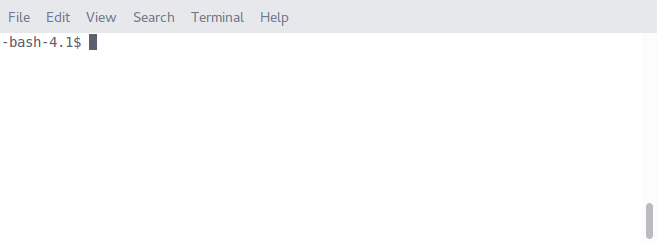
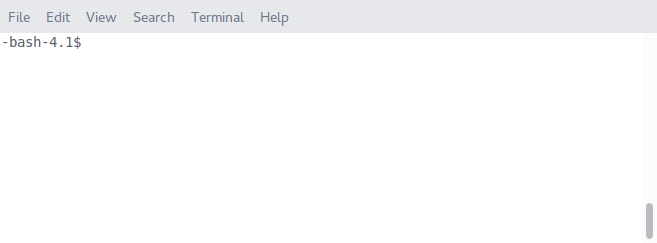
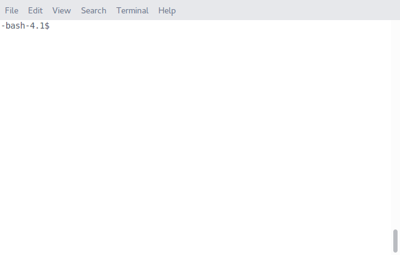

# Intro to the command line

Welcome! The command line can be one of the most powerful ways to interact with
a variety of computer systems, but it can also be a little confusing at first
glance. This mini-crash-course should help familiarize you with the basics of
command line usage and navigation.

## Open a terminal!

Hit `⌘ + Space` to bring up spotlight, then type the first few letters of
`Terminal` and select `Terminal`.


## Who am I?

Time to get started! You likely know your username since you've just logged in,
but sometimes you may have multiple accounts with slight variations on a
username.

You can always ask the terminal who you are by entering

```console
whoami
```

and hitting \<Enter\>. (From now on, after typing in a command, just hit
\<Enter\> unless we tell you otherwise.)



**Note**: These gifs were made on a Red Hat linux machine, so they'll look a
little bit different than what you see. Don't worry about it.

## Where am I?

We know who we are, time to find out *where* we are. You can always find out
what folder you're in by using the "print working directory" command, or `pwd`.
Try it out!

```console
pwd
```


We're in our home directory. This is the base directory for a regular user in
Linux or OSX. In the SEAS Mac Labs, the home directory is always
`/Users/<username>`. If you're using your own Linux machine, the home directory
is probably `/home/<username>`.

## What's in here?

We know who we are and where we are, now it's time to figure out what's in here.
We use the "list" command, `ls`, to view any files or directories that are in
the current folder.

```console
ls
```


The items you see above in the gif are all folders. They're the usual folders
created by default in Red Hat Linux. Your home folder is actually the same
folder as your Titan network drive on Windows, so you may have other files and
folders in your home directory.

## How do I go there?

To navigate to a new folder, we use the change directory command, `cd`, followed
by the name of the folder. While you *can* type out the full folder name, it's
usually nicer to use what's called Tab-completion.

Let's change to the `Pictures` directory. Type `cd Pi` and then hit the TAB key
to complete the directory name. Then hit \<Enter\>

Now you're in the `Pictures` directory. It's probably empty, but you can check
with `ls`.

To go back to your home directory, type `cd ..`

The `..` is a command-line shortcut to move "up" one folder in a directory tree.
Try `cd`-ing into a few other folders and then returning back to your home
directory to get the hang of moving around.



### Multiple tab-completions

If there are multiple possible completions for a partial directory name, you can
ask the terminal to display them by hitting TAB twice. Try entering

```console
cd Do
```

and then hit TAB twice to see the list of matching directories. Then you can add
a `c` and Tab-complete `Documents`.


## Quick config step

Now that we have a handle on basic terminal navigation, we are going to make a
few tweaks to this setup to make it friendlier. Copy the two lines below by
selecting them and hitting `⌘+c` and then paste them into the terminal using
`⌘+v` and hit \<Enter\>. 

```console
echo "export PATH=/Applications/anaconda/bin:\$PATH" >> .bash_profile
```

(If you are following along and aren't at GW, don't do this, it only applies to
the GW Mac Labs)

Now, to activate the options we just selected, type the following line in the
terminal and hit \<Enter\>

```console
source .bash_profile
```

It should look a little something like this:



## Make sure Anaconda is on your PATH

```console
python --version
```

That command should return a version number >= `3.5` and it should also say Anaconda.
