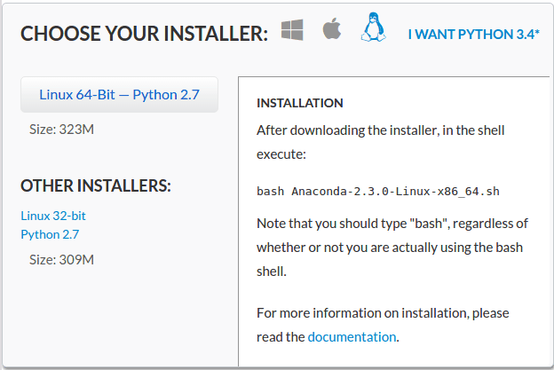
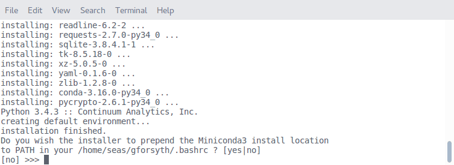

# Jupyter Install

This guide is to help you get Jupyter notebooks up and running on your personal computer.  

## 1. Install Anaconda

There are several ways to install Python and Jupyter and all of the required libraries to complete this course.  You are welcome to try out any of them, but we **strongly** suggest using the Anaconda Python Distribution.  It is up-to-date (unlike the versions of Python that may already exist on your Linux or OSX machine) and it also comes with `conda`.  We'll get to `conda` a little later, but believe us, it's awesome and you want to have it.

### Download the installer

First download the Anaconda installer.  Visit http://continuum.io/downloads to download the appropriate installer for your operating system.

**You must first click the link that says "I Want Python 3.4*"** to select the correct installer.




### Run the installer

Follow the appropriate instructions for your operating system listed on the [Anaconda Install Page](http://docs.continuum.io/anaconda/install).  For Linux users, make sure to answer "yes" when the installer asks about editing your `PATH`.



Also note that on both Linux and OSX, you have to close the current terminal window and re-open it before the Anaconda installation will be available.

## 2. Install Jupyter and other libraries

Once Anaconda is installed, you can then use the included `conda` package to install all of the necessary packages for the course.  Open a terminal and run

```Bash
conda install jupyter numpy scipy sympy matplotlib
```

## 3. Test your installation
Once `conda` is finished you should be ready to go!  Open a terminal and run

```Bash
jupyter notebook
```

to launch a notebook server.
